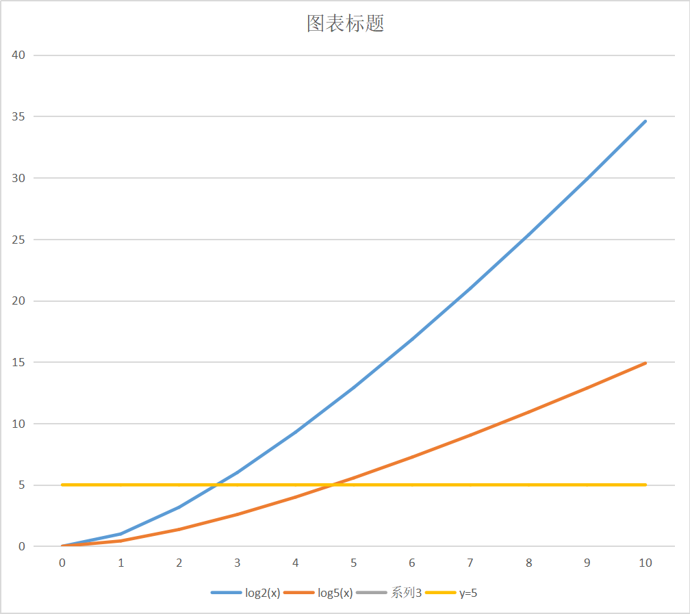

# 相似度

## 固定分数的相似度计算

每个节点 100 分。

| 类别 | 分值 | 备注 |
| --- | --- | --- |
| id | 5 | |
| tagName | 5 | |
| class | 5 | |
| dataset | 0 | dataset 和样式无关 |
| attr | 5 | selected、checked |
| rect | 20 | |
| styel | 60 | |

文本节点

不相等就是 0 分

`最后的分数` = (`所有节点分数累加和` / `节点数 \* 100`) \* `100%`

### Rect

不同系数下距离差异计算结结果

选择 log2 作为系数。

GI-complate and GL-hard problem
graph isomorimphism problem

tree base idff algorithm
